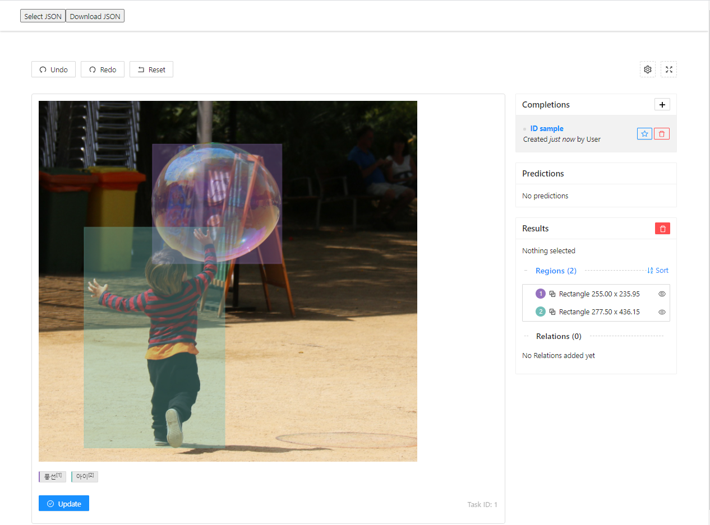
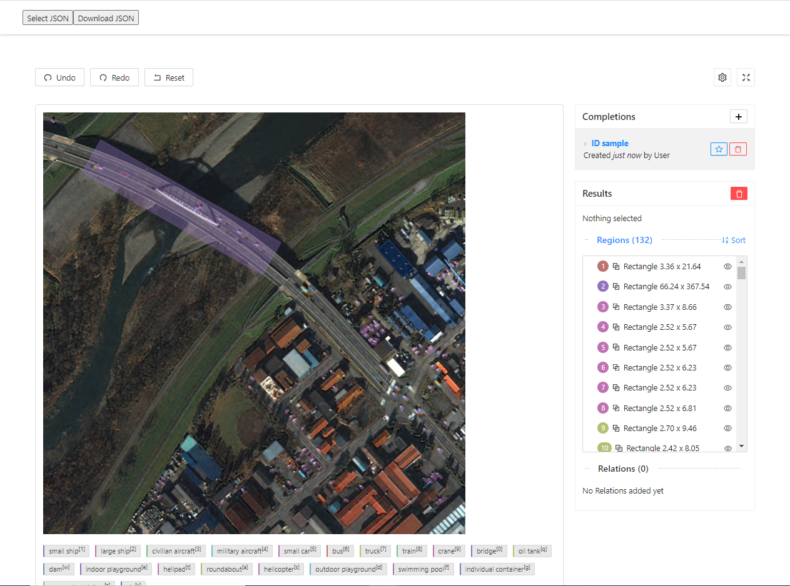

## 소개

이 프로그램은 2020년 상반기 AI 데이터 구축 1차사업 중 위성영상 AI 데이터 과제를 통하여 제작된 데이터의 시각화 및 수정을 목적으로 만들어졌습니다.

## 사용 방법

1. 프로그램 구동하기 ([serve install](https://www.npmjs.com/package/serve))
  ```bash
  serve -s build
  ```
2. 사용할 이미지 및 JSON 세팅

  제공된 sample 폴더 안의 내용과 같이, 시각화 또는 수정하고자 하는 파일들을 가져옵니다.
  이미지 파일(*.png)들은 build 폴더 안의 images에 저장해 둡니다.

3. serve에 성공하였다면, http://localhost:5000 또는 호스트 컴퓨터의 5000번 포트에 해당하는 주소에 브라우저를 통해 접근합니다. 그러면 다음과 같은 초기 화면을 볼 수 있습니다.
  

4. 이제 상단의 Select JSON 버튼을 클릭하여, 시각화 또는 수정하고자 하는 JSON 파일을 선택합니다. 일정 시간의 로딩이 끝나면, 다음과 같이 화면이 전환됩니다. 주요 기능은 다음과 같습니다.

  이미지 아래의 클래스 버튼을 클릭하여 새 객체를 추가할 수 있습니다.
  이미지 오른쪽의 목록을 클릭하여 객체를 선택할 수 있습니다.
  이미지 위의 객체들을 클릭하여 객체를 선택할 수 있습니다.
  선택된 객체들을 이미지 위에서 수정하거나 삭제할 수 있습니다.
  

5. 수정이 완료되면 상단의 Download JSON 버튼을 클릭합니다. 그러면 선택하여 업로드 한 JSON과 같은 형태와 이름을 가진 JSON 파일이 다운로드 됩니다.


## Changes

No changes have been made to original source code([label-studio-frontend](https://github.com/https://github.com/heartexlabs/label-studio-frontend)). All changes could be found from public/index.html

## Install

```bash
npm install label-studio
```

## Usage

```xhtml
<!-- Include Label Studio stylesheet -->
<link href="https://unpkg.com/label-studio@0.8.0/build/static/css/main.css" rel="stylesheet">

<!-- Create the Label Studio container -->
<div id="label-studio"></div>

<!-- Include the Label Studio library -->
<script src="https://unpkg.com/label-studio@0.8.0/build/static/js/main.js"></script>

<!-- Initialize Label Studio -->
<script>
  var labelStudio = new LabelStudio('label-studio', {
    config: `
      <View>
        <Image name="img" value="$image"></Image>
        <RectangleLabels name="tag" toName="img">
          <Label value="Hello"></Label>
          <Label value="World"></Label>  
        </RectangleLabels>
      </View>
    `,

    interfaces: [
      "panel",
      "update",
      "controls",
      "side-column",
      "completions:menu",
      "completions:add-new",
      "completions:delete",
      "predictions:menu",
    ],

    user: {
      pk: 1,
      firstName: "James",
      lastName: "Dean"
    },

    task: {
      completions: [],
      predictions: [],
      id: 1,
      data: {
        image: "https://htx-misc.s3.amazonaws.com/opensource/label-studio/examples/images/nick-owuor-astro-nic-visuals-wDifg5xc9Z4-unsplash.jpg"
      }
    },
    
    onLabelStudioLoad: function(LS) {
      var c = LS.completionStore.addCompletion({
        userGenerate: true
      });
      LS.completionStore.selectCompletion(c.id);
    }
  });
</script>    
```

## Development

1. Clone the repository
   ```bash
   git clone git@github.com:heartexlabs/label-studio-frontend.git
   # or: git clone https://github.com/heartexlabs/label-studio-frontend.git
   cd label-studio-frontend
   ```

2. Install required dependencies
   ```bash
   npm install
   ```

3. Start the development server
   ```bash
   npm run start
   ```
   
4. Check different ways to initiate the development server config & task data in `src/env/development.js`, changing the `data` variable is a good place to start.

5. After you make changes and ready to use it in production, you need to create a production build
   ```bash
   npm run build-bundle
   ```
   Now you have one .js file and one .css file in the `build/static/` directory


## Label Studio for Teams, Startups, and Enterprises :office:

Label Studio for Teams is our enterprise edition (cloud & on-prem), that includes a data manager, high-quality baseline models, active learning, collaborators support, and more. Please visit the [website](https://www.heartex.ai/) to learn more.

## Ecosystem

| Project | Description |
|-|-|
| [label-studio](https://github.com/heartexlabs/label-studio) | Server part, distributed as a pip package |
| label-studio-frontend | Frontend part, written in JavaScript and React, can be embedded into your application | 
| [label-studio-converter](https://github.com/heartexlabs/label-studio-converter) | Encode labels into the format of your favorite machine learning library | 
| [label-studio-transformers](https://github.com/heartexlabs/label-studio-transformers) | Transformers library connected and configured for use with label studio | 

## License

This software is licensed under the [Apache 2.0 LICENSE](/LICENSE) © [Heartex](https://www.heartex.ai/). 2020


